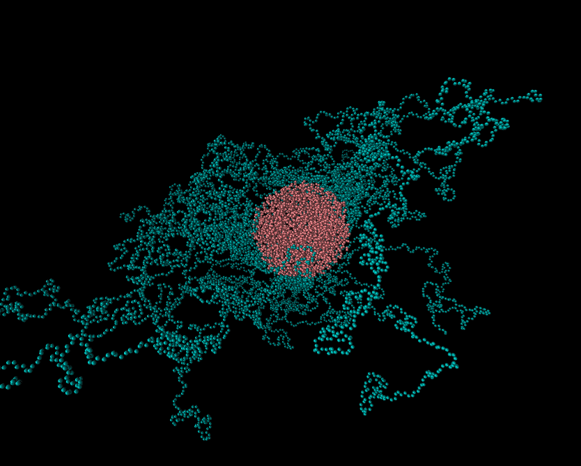
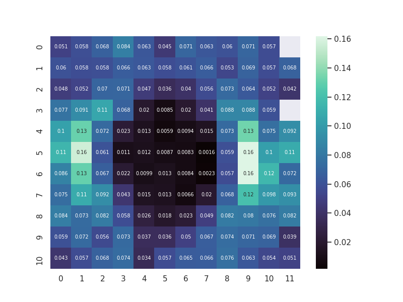

# Strain Calculation Tool

## About

This is a set of python scripts used to calculate and visualize the atomistic strain of a molecular trajectory.  

The main script is **calc_atomistic_strain.py**, is used to caclulate the strain of the molecular trajectory. It facilitates mpi to parallelize the calculations. It also uses numba for further acceleration. So in order to run the script you should have installed the mpi4py and numba packages, as well as numpy and scipy.

The input trajectories must be in the format of the [LAMMPS](https://www.lammps.org)  molecular dynamics simulator dump files. Note that the trajectories should also contain the unwrapped coordinates of the atoms. A small trajectory that can be used for testing the code is included in **trajectory.zip**. You should of course extract the trajectory from the zip file before running the tool. 

In order to calculate the strain for some frame in the trajectory, a prior reference frame must be specified as well. So you may want to calculate the strain for timesteps 200 and 250 in reference to timestep 50. In such a case, two oupupt files will be created after the calculation, *strain_from_50_to_200.npy* and *strain_from_50_to_250.npy*. They are numpy binary files containing the strain per atom for each respective frame. If there are *N* atoms in the molecular system each file will contain an *(N,3,3)* numpy float array, which can be loaded with *numpy.load* for further analysis.

A second script, **plot_heatmap.py**, is provided to illustrate how analysis of the strain calculations could be performed. It takes as input the results of the calculation script and produces a heatmap plot of the strain at an intersection of the molecular system.

A third script, **calc_strain_per_region.py**, is provided to illustrate the calculalation of the strain per region, for a trajectory of the format contained in **trajectory.zip**. Two regions around the nanoparticle are defined, using the parameters inteface and bulk rin and rout. These paramers define the spheres, centered at the nanoparticle center, that define the boundaries of the interface and the bulk regions. The script calculates the average strain for these two regions at each frame and the results are saved in a text file.

These scripts are implementations of the methodology defined at:

1.  H. Reda, A.Chazirakis, A. Behbahani, N. Savva, V. Harmandaris, “A methodology for determining the local mechanical properties of model atomistic glassy polymeric nanostructured materials”, Submitted to MethodX

2.  H. Reda, A.Chazirakis, A. Behbahani, N. Savva, V. Harmandaris, “Mechanical properties of glassy polymer nanocomposites via atomistic and continuum models: The role of interphases”, Computer Methods in Applied Mechanics and Engineering 395, 114905 (2022).

## Example Molecular System 

The molecular system in the sample trajectory is comprised of a Silica nanoparticle surrounded by Polybutadiene matrix. As the system is strained by an applied deformation along the x axis, it responds nonuniformly to the deformation. The silica nanoparticle is stiff and does not deform, so the local strain there *(Sxx)* is almost zero. The strain far away from the nanoparticle is close to the global strain applied. The remaining strain, at the region just out of the nanoparticle, is higher than the bulk strain to compensate for the zero strain in the nanoparticle.

## Usage

### Calculation Script

Several command line options control the **calc_atomistic_strain.py** script's behaviour. 

+ \-\-trajectory : The input LAMMPS trajectory filename
+ \-\-startframe : The reference timestep of the deformation. It defaults to zero if not set.
+ \-\-endframes : The series of timesteps for which to calculate the strain.
+ \-\-rcut : The cutoff distance used during the calculation of the strain. It defaults to 8 Angstroms.
+ \-\-dest_folder : The destination folder where to place the calculated strain files.

#### Example Usage

*mpirun -n 2 python calc_atomistic_strain.py \-\-trajectory trajectory.lammpstrj \-\-startframe 50 \-\-endframes 250 300 \-\-rcut 10 \-\-dest_folder dats/*

This will create files *strain_from_50_to_250.npy* and *strain_from_50_to_300.npy* in the *dats* folder. The folder must already exist. The calculation will be performed using 2 processors. The created files can be read by some analysis script using *numpy.load*.

*Note that this script will not work well for triclinic simulation boxes.*
  
### Sample Analysis Script

The **plot_heatmap.py** analysis script takes as input the output of the first script, the local strain per atom, and spatially aggregates the results into cubic boxes of user defined edge length. The results are then visualized through a heatmap plot. There are a few command line parameters that control the execution of this script.

+ \-\-trajectory : The input LAMMPS trajecory filename.
+ \-\-frame : The end frame for which the strain was calculated.
+ \-\-strain : The filename of the binary nympy file containing the calculated strain.
+ \-\-aggsize : The cubic box edge length. Defaults to 6 Angstroms if not specified.
+ \-\-row : The row of the strain tensor to plot.
+ \-\-col : The column of the strain tensor to plot.
+ \-\-outfname : The filename where to save the plot at (*.png, *.pdf, etc). The plot will open in a new window if not set.

#### Example Usage

*python plot_heatmap.py \-\-trajectory trajectory.lammpstrj \-\-frame 250 \-\-strain dats/strain_from_50_to_250.npy \-\-aggsize 6 \-\-row 0 \-\-col 0*

This will create the plot below. The x axis is the axis of deformarion, while the intersection chosen at the z axis is at the middle of the box. Note that the silica nanoparticle is placed at the center of the box. So what we see below is an intersection passing through the center of the nanoparticle. The strain in the nanoparticle is almost zero, while just outside of it, at the x direction, it is much higher than in the bulk area. 

### Per Region Calculation Script

Several command line options control the **calc_strain_per_region.py** script's behaviour. 

+ \-\-trajectory : The input LAMMPS trajectory filename
+ \-\-intf_rin : The starting radius that defines the interface region (default 21.0).
+ \-\-intf_rout : The ending radius that defines the interface region (default 25.0).
+ \-\-blk_rin : The starting radius that defines the bulk region (default 25.0).
+ \-\-blk_rout : The ending radius that defines the bulk region (default 29.0).
+ \-\-rcut : The cutoff distance used during the calculation of the strain (default 8.0).
+ \-\-outfile : The destination folder where to place the calculated strain data (default per_region.txt).

#### Example Usage

*calc_strain_per_region.py \-\-trajectory trajectory.lammpstrj*

This will create the file *per_region.txt* in the current folder. The text file will contain several rows, equal to the number of frames in the trajectory minus one, and three columns. The first column is the time step, the second is the intefrace strain and the third is the bulk strain. Note that in order to produce a meaningful smooth enough stress per strain plot, you would need a trajectory with far greater statistics that can be included here. Typically you would need a trajectory with 64 nanoparticles and averaging of the the interface and the bulk strain over all nanoparticles. Although it is a bit tedious process, LAMMPS provides the tools for performing such calculations.

*Note that this script will not work well for triclinic simulation boxes.*

